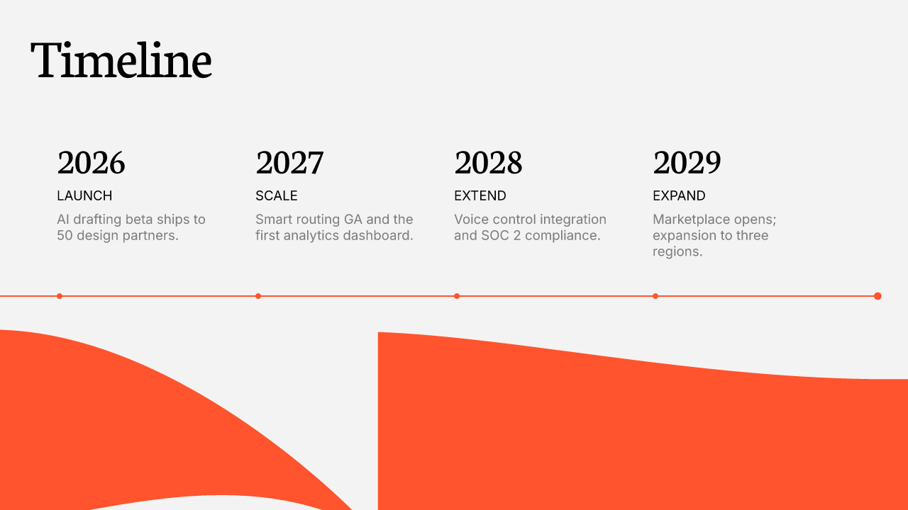
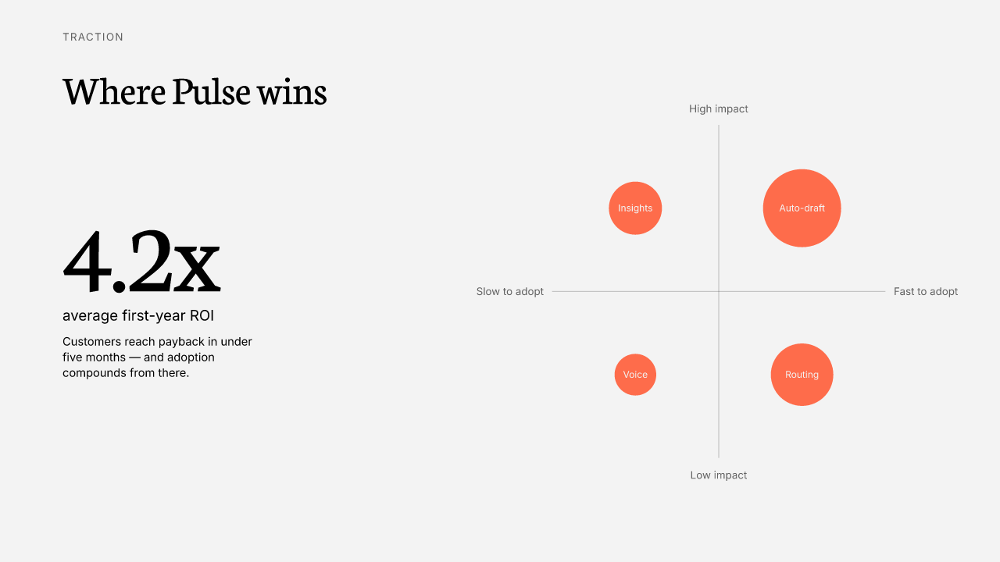
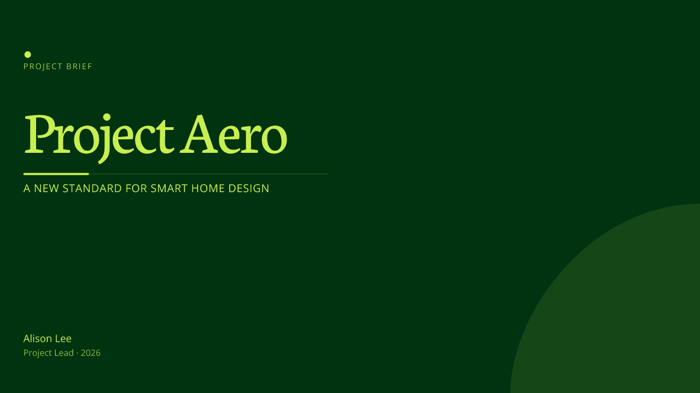
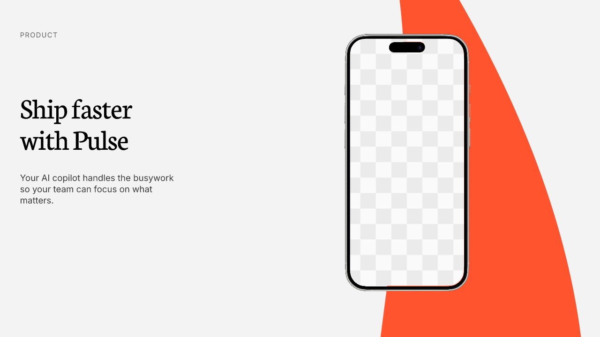
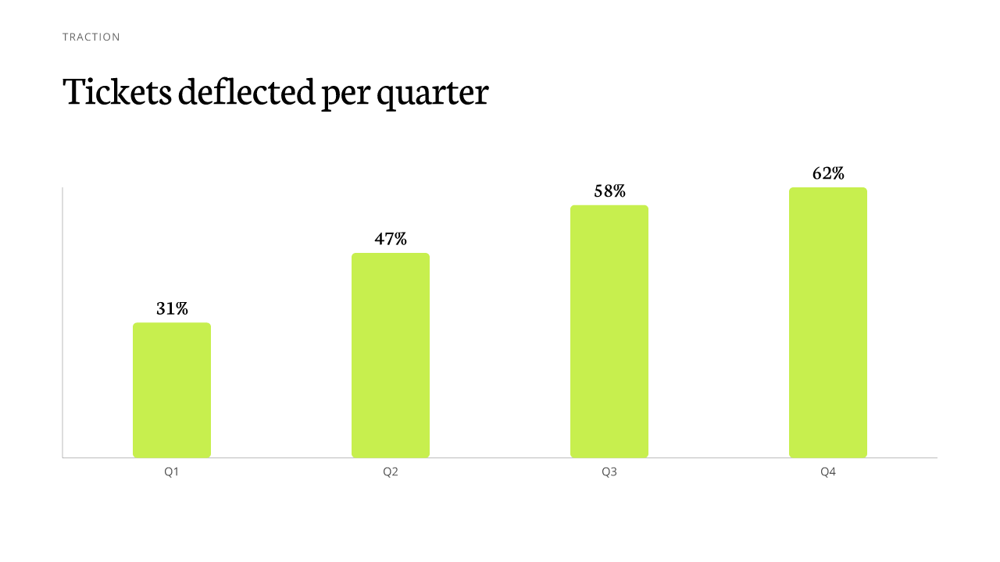
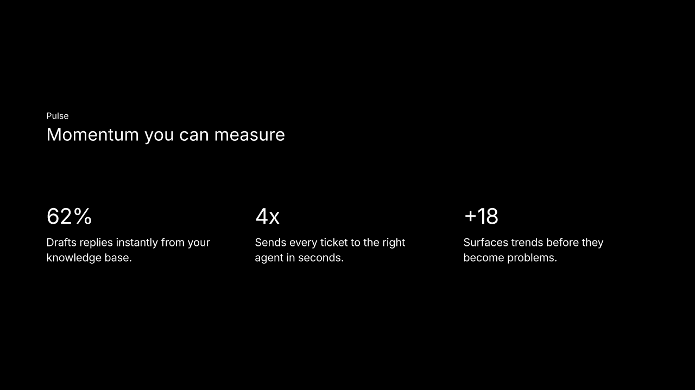

# Stencil

**An agentic generative system for design-grammar slide synthesis.**

Stencil treats uploaded slides not as fill-in templates, but as *design example data*. It distills each deck into a reusable **design system** — palette, type scale, spacing rhythm, alignment grid, component blocks, archetype skeletons, decoration vocabulary, and device mockups — then **synthesizes brand-new layouts** from that grammar. No source frame is ever copied.

The core engineering decision is a single, deliberate split:

> **AI reasons about meaning. Deterministic code owns every pixel.**

Claude (vision + tool-use) classifies slots, picks archetypes, writes content, and critiques rendered output. A deterministic engine owns all geometry — coordinates from the grid, exact text metrics (opentype.js), collision-free placement, contrast floors. The LLM never emits a coordinate.

<p align="center">
  
  
  
</p>
<p align="center">
  
  
  
</p>

> 🚀 **Live app → https://stencil-web.vercel.app/** — type a prompt, get newly synthesized slides (3 themes).
>
> 📊 **Project report → https://youngbin03.github.io/stencil/** — the full pipeline, AI-engineering decisions, hard problems, results, and the colorful design-system board. (Source: [`docs/portfolio.html`](docs/portfolio.html).)

---

## How it works — bake once, stamp many

```
BAKE  (per theme, once)                         STAMP  (per request)
─────────────────────────────                   ─────────────────────────────
1  Parse    slides → measured slots             4  Plan       prompt → archetype + content   (Claude)
2  Grammar  palette · type · grid · rhythm      5  Synthesize skeleton + grammar → new coords (grammar-only)
3  Skeleton archetype zones (aggregated)        6  Solve      fit · push-down · safe area     (deterministic)
        ↓                                        7  Evaluate   7 scores · revise / reject       (gate)
   GrammarSpec  ──────────────────────────────────────┘
   (blocks · cardSpec · skeletons · mockups)
```

Expensive AI analysis runs **once per theme** and is cached as a `GrammarSpec`. At request time the original SVG is never re-read — only the cached grammar is recombined. The evaluator scores each synthesized slide (grammar consistency, novelty, hierarchy, spacing, fit, similarity penalty, overall) and **re-synthesizes** anything that fails the gate.

## What it does

- **Layout synthesis** — new slides composed from mined archetype skeletons + grammar, not copied frames.
- **Data visualization** — timeline, metric (2×2 bubble quadrant), bar chart, numbered steps — generated deterministically, themed from the palette and type scale.
- **Device mockups** — iPhone / MacBook frames extracted as reusable assets; synthesis stamps the frame and leaves the screen as an empty, notch-accurate clip slot for the user to fill (we place, never generate, imagery).
- **Quality gate** — an evaluator–optimizer loop with a 7-metric rubric and a novelty floor.
- **Design-system inspector** — every theme rendered as documentation (palette, type specimens, grid, blocks, skeletons, mockups).
- **Web app** — a Next.js front end to generate decks from a prompt and inspect quality scores.

## Tech stack

TypeScript (strict, ESM) · npm-workspaces monorepo · Anthropic SDK (Claude, vision + tool-use) · opentype.js (font metrics) · resvg-js (rasterization) · Next.js + React (web) · Node ≥ 20.

## Repository layout

```
packages/
  ir/          shared types — the contracts every stage speaks
  normalizer/  ingest: SVG → measured slots, transforms, mockup extraction
  classifier/  Claude vision slot classification + rasterization
  extractor/   assetize: tokens, grammar, blocks, skeletons, relations
  synthesizer/ GrammarSpec + grammar-only layout synthesis + evaluator
  solver/      deterministic placement — fit, push-down, self-check
  renderer/    composite SVG assembly (editable text over decoration)
  director/    Claude content/outline planning (tool-use contracts)
  composer/    deck outlining
  critic/      vision-based slide critique
apps/web/      Next.js generator UI
scripts/       bake, render, gallery, and example generators
docs/          portfolio report + assets
templates/     example design decks (the input "example data")
```

## Getting started

```bash
npm install
npm run build

# Optional: vision classification + generation need a key
echo "ANTHROPIC_API_KEY=sk-ant-..." > .env.local

# Assetize a theme (geometry only is free; add a key for vision roles)
node scripts/bake-mockup.mjs templates/colorfulldesign --no-classify

# Generate example slides → fixtures/out/
node scripts/portfolio-results.mjs
node scripts/viz-slides.mjs

# Run the web app
cd apps/web && npm run dev
```

Generated artifacts and baked assets live under `fixtures/` (git-ignored); the committed `templates/` are the design inputs.

## Status

The bake → synthesize → solve → evaluate pipeline runs end-to-end across three themes (colorful, black, green) with text, data-viz, and device-mockup slides. Active areas: richer relation-graph consumption, a constraint-solver placement backend, and image-aware archetype selection.

---

<sub>A solo project exploring agentic generation and programmatic design systems. Code comments and commits in English; built and documented as a portfolio piece.</sub>
